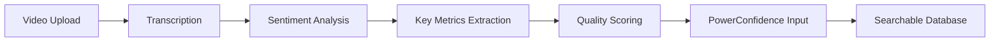
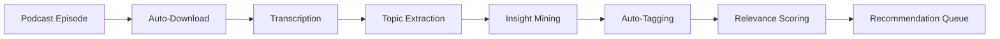
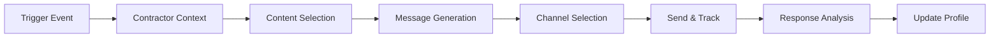

# 🤖 TPX AI-First Strategy & Architecture
*The Power100 Experience - AI Concierge Vision & Implementation Guide*

---

## 🎯 Executive Summary

The Power100 Experience (TPX) is evolving into an **AI-first platform** where artificial intelligence isn't just a feature—it's the core value proposition. Our AI Concierge will be contractors' "EVERYTHING"—a personalized business advisor available 24/7 that knows their business intimately and provides contextual, actionable guidance across all aspects of their growth journey.

### Core Vision
> "Every contractor has a personal AI advisor that knows their business better than they do, anticipates their needs, and connects them with the exact resources, knowledge, and partners they need at the precise moment they need them."

---

## 🧠 AI Concierge Capabilities

### 1. **Personalized Business Advisor**
The AI Concierge serves as an always-available expert that:
- Maintains complete context of contractor's business (revenue, team size, location, history)
- Understands current challenges and growth trajectory
- Provides proactive recommendations before problems arise
- Learns from every interaction to improve future guidance

### 2. **Intelligent Recommendation Engine**
Beyond basic matching, the AI provides:
- **Multi-dimensional recommendations** across all entities (partners, books, podcasts, events)
- **Contextual timing** - Right resource at the right moment
- **ROI predictions** - Expected outcomes based on similar contractors
- **Implementation guidance** - Not just what, but HOW

### 3. **Proactive Communication Agent**
AI-driven outreach that:
- Crafts personalized emails/texts based on contractor profile
- Triggers at optimal engagement moments
- A/B tests messaging for maximum impact
- Maintains appropriate cadence without overwhelming

### 4. **Content Analysis & Processing**
Automated analysis of all content:
- **Video Analysis**: Client demos, testimonials (sentiment, authenticity, quality)
- **Audio Processing**: Podcast transcription, summarization, insight extraction
- **Document Analysis**: Book summaries, key concepts, actionable takeaways
- **Real-time Tagging**: Auto-categorization for perfect matching

### 5. **Event Experience Orchestrator** *(ENHANCED from Greg's Vision - Sept 2025)*
AI-powered event companion that transforms commercial events into personalized experiences:

- **Pre-Event Preparation**:
  - Pre-fill attendee data from existing contractor profiles
  - Sponsor registration campaign (100% completion required)
  - Text on registration OR mass send at specific time (stage coordination)
  - Smart profile completion (intentionally blank contact fields for real data)
  - Custom agenda based on 3 focus areas + tech stack
  - Top 3 speakers with WHY explanations
  - Top 3 sponsors with specific booth contacts (name, title)
  - Prepared talking points for each interaction

- **During-Event Guidance**:
  - Check-in triggered personalized greeting
  - Real-time speaker alerts 15 min before relevant sessions
  - Sponsor booth guidance with conversation starters
  - Example: "Tell them: I'm looking for greenfield growth..."
  - Peer matching system (same role, different market)
  - "Find your peer" prompts at breaks
  - Interactive note-taking via SMS
  - Continuous qualifying questions based on context
  - Next sponsor recommendations between sessions
  - CEO override system for timing adjustments (Greg can delay messages)

- **Real-time Engagement & Scoring**:
  - PCR (Power Confidence Rating) for EVERYTHING
  - Live speaker grading (conversational, not surveys)
  - Sponsor interaction quality tracking
  - Demo booking confirmation & tracking
  - Conversational analysis for quality detection
  - Assumptive scoring through natural conversation
  - Profile completion gate (must complete to access features)

- **Post-Event Processing**:
  - Comprehensive event summary with breakdowns
  - Speaker performance rankings (year-end list)
  - Follow-up scheduling for booked demos
  - Contact exchange between matched peers
  - "Super fancy dashboard" with all metrics
  - Continuous engagement (never-ending AI coach)
  - Building personal AI agent tied to closed-loop LLM

---

## 📊 Current State vs. Target State

### ✅ What We Have (Information Retrieval System)

| Component | Current State | Readiness |
|-----------|--------------|-----------|
| **Contractor Profiles** | Basic (revenue, team size, focus areas) | 40% |
| **Partner Matching** | Rule-based (60/20/10/10 weights) | 60% |
| **Database Structure** | Entities exist, AI fields limited to `ai_` prefix | 30% |
| **SMS Opt-in** | Legal consent captured | 100% |
| **API Infrastructure** | RESTful, authenticated | 70% |
| **Data Access** | Restricted to AI-prefixed fields only | 10% |
| **Learning Capability** | None - static responses | 0% |

### 🎯 What We Need (Learning Expert System)

| Component | Target State | Priority |
|-----------|-------------|----------|
| **Complete Data Access** | ALL operational data (except sensitive) visible to AI | CRITICAL |
| **Learning Infrastructure** | ai_learning_events, patterns, feedback loops | CRITICAL |
| **Behavioral Tracking** | Every interaction tracked and learned from | HIGH |
| **Outcome Measurement** | Every recommendation tracked to result | HIGH |
| **Personalization Engine** | Unique responses per contractor | HIGH |
| **Pattern Recognition** | Discover what works for whom | MEDIUM |
| **Predictive Analytics** | Anticipate needs before asked | MEDIUM |

---

## 🗄️ Data Architecture for AI

### Universal AI Fields (ALL Entities)

```typescript
interface AIEnhancedEntity {
  // Core Identity
  id: string;
  type: 'partner' | 'book' | 'podcast' | 'event';
  
  // AI Analysis Fields
  ai_summary: string;                    // AI-generated summary
  ai_tags: string[];                      // Auto-extracted topics
  ai_insights: ActionableInsight[];      // Extracted actionable items
  ai_quality_score: number;              // 0-100 quality rating
  ai_relevance_scores: {                 // Per focus area
    [focusArea: string]: number;
  };
  
  // Engagement Tracking
  total_recommendations: number;          // Times recommended by AI
  positive_outcomes: number;              // Successful engagements
  contractor_feedback: FeedbackItem[];    // Direct feedback
  engagement_rate: number;               // Click/interaction rate
  
  // Cross-References
  related_entities: {
    books: string[];
    podcasts: string[];
    events: string[];
    partners: string[];
  };
  
  // ROI/Success Metrics
  success_stories: SuccessStory[];
  implementation_difficulty: 'easy' | 'moderate' | 'complex';
  time_to_value: string;                 // "immediate", "1 week", "1 month"
  investment_required: InvestmentRange;
  
  // AI Processing Metadata
  last_ai_analysis: timestamp;
  ai_confidence_score: number;           // How confident AI is in its analysis
  requires_human_review: boolean;
  processing_status: 'pending' | 'processed' | 'failed';
}
```

### Contractor Enhanced Profile

```typescript
interface AIContractorProfile {
  // Existing Fields
  id: string;
  company_name: string;
  revenue_range: string;
  team_size: number;
  focus_areas: string[];
  
  // AI Behavioral Data (NEW)
  communication_preferences: {
    channels: ('email' | 'sms' | 'phone' | 'in_app')[];
    frequency: 'daily' | 'weekly' | 'bi_weekly' | 'monthly';
    best_times: string[];               // "morning", "afternoon", "evening"
    time_zone: string;
  };
  
  learning_preferences: {
    content_type: ('video' | 'audio' | 'text' | 'interactive')[];
    session_length: 'micro' | 'short' | 'medium' | 'long';  // 5min, 15min, 30min, 60min+
    depth: 'summary' | 'detailed' | 'comprehensive';
  };
  
  // Business Context (NEW)
  business_goals: {
    goal: string;
    timeline: date;
    priority: 1-5;
    current_progress: number;           // 0-100%
  }[];
  
  current_challenges: {
    challenge: string;
    severity: 'critical' | 'high' | 'medium' | 'low';
    attempted_solutions: string[];
    open_to_solutions: boolean;
  }[];
  
  // AI Interaction History (NEW)
  ai_interactions: {
    timestamp: date;
    query: string;
    response: string;
    helpful: boolean;
    action_taken: string;
    outcome: string;
  }[];
  
  // Recommendation History (NEW)
  recommendations_received: {
    entity_type: string;
    entity_id: string;
    timestamp: date;
    reason: string;
    engagement: 'ignored' | 'viewed' | 'clicked' | 'completed';
    feedback: string;
    outcome: string;
  }[];
  
  // Predictive Metrics (NEW)
  engagement_score: number;            // 0-100, likelihood to engage
  churn_risk: number;                  // 0-100, risk of disengagement
  growth_potential: number;             // 0-100, likelihood of business growth
  next_best_action: string;            // AI-determined next step
  lifecycle_stage: 'onboarding' | 'active' | 'power_user' | 'at_risk' | 'churned';
}
```

---

## 🧠 The Learning Architecture - From Static to Dynamic

### Critical Mindset Shift Required
**FROM:** "Protect data from AI" (restrictive access)
**TO:** "Empower AI with data" (comprehensive access)

### The Three-Layer Learning System

#### Layer 1: Comprehensive Data Access
```javascript
// CURRENT (Broken - Only 2% of data visible)
const isRelevant = (column) => column.startsWith('ai_');

// REQUIRED (Complete visibility)
const isRelevant = (column) => {
  const sensitive = ['password', 'token', 'secret', 'ssn'];
  return !sensitive.some(s => column.includes(s));
};
```

#### Layer 2: Learning Infrastructure (5 Critical Tables)
1. **ai_learning_events** - Track every AI action and outcome
2. **ai_patterns** - Discovered success/failure patterns
3. **contractor_ai_profiles** - Personalization per contractor
4. **ai_insights** - System-discovered knowledge
5. **ai_feedback_loops** - Measure prediction accuracy

#### Layer 3: Active Learning Mechanisms
- Real-time interaction tracking
- Outcome measurement system
- Pattern recognition engine
- Personalization engine
- Predictive analytics

## 🔄 AI Processing Pipelines

### 1. Video Analysis Pipeline (Client Demos)


**Implementation:**
- OpenAI Vision API for visual analysis
- Whisper API for audio transcription
- GPT-4 for insight extraction
- Custom scoring algorithm

### 2. Podcast Processing Pipeline


**Implementation:**
- RSS feed monitoring
- Whisper API transcription
- GPT-4 topic modeling
- Vector embeddings for semantic search

### 3. Intelligent Communication Pipeline


**Implementation:**
- Event-driven architecture
- GPT-4 for message generation
- N8N workflow orchestration
- Real-time analytics

---

## 📈 Success Metrics & KPIs

### AI Effectiveness Metrics
- **Recommendation Acceptance Rate**: % of AI suggestions acted upon
- **Time to Value**: Average time from recommendation to positive outcome
- **Engagement Lift**: Increase in platform usage after AI implementation
- **Satisfaction Score**: Contractor rating of AI assistance

### Business Impact Metrics
- **Contractor Retention**: Month-over-month active users
- **Match Quality**: Success rate of AI-matched partnerships
- **Revenue Attribution**: Revenue generated from AI recommendations
- **Support Deflection**: Reduction in human support needs

### Technical Performance Metrics
- **Processing Speed**: Time to analyze and tag content
- **Accuracy Rate**: Correct categorization/tagging percentage
- **Response Time**: AI concierge response latency
- **System Uptime**: AI service availability

---

## 📊 Implementation Status (As of September 25, 2025)

### Overall Progress: 85% Complete

| Component | Status | Details |
|-----------|--------|---------|
| **Book Processing** | ✅ 100% | Full pipeline, automated triggers, AI summaries working in production |
| **Podcast Processing** | ✅ 100% | Full pipeline, YouTube/RSS transcription, n8n automation, auto-triggers |
| **Event Orchestrator** | ⚠️ 75% | Check-in system COMPLETE, Agenda Management COMPLETE with AI-ready structure, ALL backend controllers built. Missing: AI recommendations, real-time PCR scoring |
| **Event Agenda System** | ✅ 100% | Full CRUD, dynamic multi-day support, speaker/sponsor tracking, AI-ready fields (September 25, 2025) |
| **Communication Engine** | ✅ 70% | 6 n8n workflows, SMS/email working. Missing: AI personalization |
| **Behavioral Learning** | ✅ 70% | Learning infrastructure COMPLETE, all interactions tracked, patterns stored. Missing: ML algorithms |
| **Partner Processing** | ✅ 100% | Fully automated, AI summaries + differentiators, DynamicPromptBuilder integrated |
| **Video Processing** | ✅ 100% | Complete with transcription, n8n workflow, auto-triggers |
| **Database-to-AI Pipeline** | ✅ 100% | Event triggers, auto-registration, zero manual steps |
| **Core AI Services** | ✅ 100% | OpenAI GPT-4, Whisper API, DynamicPromptBuilder, AI Concierge with admin testing |

### Key Achievements ✅
- **Complete Infrastructure**: 40+ AI-enabled tables with proper schema
- **Production Database Triggers**: Auto-detection and registration of new entities
- **Working AI Concierge**: Conversational interface with dynamic knowledge base
- **n8n Orchestration**: 15+ automation workflows for various processes
- **Partner AI Pipeline**: Fully automated processing with AI summaries AND contextual differentiators (Sept 2025)
- **Book AI Processing**: Complete pipeline with AI summaries verified in production (Sept 2025)
- **Video Analysis**: COMPLETE with Whisper/YouTube transcription, auto-triggers
- **Podcast AI Processing**: COMPLETE with YouTube/RSS transcription, n8n automation
- **100% Automation**: All content processing triggers automatically without n8n dependencies
- **DynamicPromptBuilder**: Sophisticated AI context formatting that auto-detects all ai_* fields (Sept 2025)
- **Admin Testing in Production**: Admins can test AI Concierge as any contractor (Sept 2025)
- **AI Field Auto-Discovery**: Any field prefixed with ai_ automatically appears in AI Concierge (Sept 2025)
- **Event Agenda Management**: Complete CRUD with speaker/sponsor tracking, multi-day support (Sept 25, 2025)
- **Smart Navigation**: Implemented intelligent back button behavior across event pages (Sept 25, 2025)

### Remaining Gaps ❌
- **Event Real-time Features**: SMS orchestration for live events
- **ML/Predictive Models**: Currently rule-based, needs learning algorithms

## 🎪 Event Orchestrator - The Perfect Learning Pilot (September 2025)

### Why Event Orchestrator First?
The Event Orchestrator is not just an event management system - it's the **ideal pilot program for our learning AI**. Every event interaction provides immediate, measurable feedback that trains the AI Concierge.

### Event Data as AI Training Ground
- **Real-time feedback loops**: PCR scores, speaker ratings, sponsor engagement
- **Measurable outcomes**: Demo bookings, peer connections, follow-through rates
- **Behavioral patterns**: Session attendance, booth visits, peer interactions
- **Preference learning**: Content preferences, timing patterns, engagement styles
- **Success/failure data**: What worked, what didn't, for whom

### Current Assets (40% Complete)
- ✅ `events` table (48 columns)
- ✅ `ai_event_experiences` table (23 columns)
- ✅ SMS infrastructure (`smsController.js`)
- ✅ AI Concierge conversational interface
- ✅ Partner matching algorithm
- ✅ Event check-in system with QR codes (Sept 2025)
- ✅ Event messaging controller with CEO override (Sept 2025)
- ✅ n8n webhook integration for GHL SMS (Sept 2025)
- ✅ All 6 event tables created in production & local (Sept 2025)

### Required Database Tables
```sql
-- 1. Event Attendees (Registration & Check-in)
CREATE TABLE event_attendees (
  id SERIAL PRIMARY KEY,
  event_id INTEGER REFERENCES events(id),
  contractor_id INTEGER REFERENCES contractors(id),
  registration_date TIMESTAMP,
  check_in_time TIMESTAMP,
  check_in_method VARCHAR(50), -- 'qr_code', 'manual', 'mass_trigger'
  profile_completion_status VARCHAR(50),
  profile_completion_time TIMESTAMP,
  sms_opt_in BOOLEAN DEFAULT false,
  real_email VARCHAR(255), -- Captured during profile completion
  real_phone VARCHAR(50), -- Captured during profile completion
  UNIQUE(event_id, contractor_id)
);

-- 2. Event Speakers
CREATE TABLE event_speakers (
  id SERIAL PRIMARY KEY,
  event_id INTEGER REFERENCES events(id),
  name VARCHAR(255),
  title VARCHAR(255),
  company VARCHAR(255),
  session_title TEXT,
  session_time TIMESTAMP,
  focus_areas JSONB,
  pcr_score NUMERIC(5,2), -- Power Confidence Rating
  total_ratings INTEGER DEFAULT 0,
  average_rating NUMERIC(3,1)
);

-- 3. Event Sponsors
CREATE TABLE event_sponsors (
  id SERIAL PRIMARY KEY,
  event_id INTEGER REFERENCES events(id),
  partner_id INTEGER REFERENCES strategic_partners(id),
  booth_number VARCHAR(50),
  booth_representatives JSONB, -- [{name, title, phone, email}]
  focus_areas_served JSONB,
  talking_points TEXT,
  demo_booking_url VARCHAR(255)
);

-- 4. Event Messages
CREATE TABLE event_messages (
  id SERIAL PRIMARY KEY,
  event_id INTEGER REFERENCES events(id),
  contractor_id INTEGER REFERENCES contractors(id),
  message_type VARCHAR(50), -- 'check_in', 'speaker_alert', 'sponsor_recommendation', 'peer_match'
  scheduled_time TIMESTAMP,
  actual_send_time TIMESTAMP,
  message_content TEXT,
  response_received TEXT,
  pcr_score NUMERIC(5,2), -- If applicable
  delay_minutes INTEGER DEFAULT 0 -- CEO override delays
);

-- 5. Peer Matches
CREATE TABLE event_peer_matches (
  id SERIAL PRIMARY KEY,
  event_id INTEGER REFERENCES events(id),
  contractor1_id INTEGER REFERENCES contractors(id),
  contractor2_id INTEGER REFERENCES contractors(id),
  match_criteria JSONB, -- {job_title, industry, geography}
  introduction_sent BOOLEAN DEFAULT false,
  connection_made BOOLEAN DEFAULT false,
  UNIQUE(event_id, contractor1_id, contractor2_id)
);
```

### How Event Orchestrator Builds AI Learning

Every event interaction creates training data:

```javascript
// Example: Speaker Rating Creates Learning Event
async handleSpeakerRating(contractorId, speakerId, rating, comment) {
  // 1. Process the rating
  await this.updateSpeakerScore(speakerId, rating);

  // 2. Create learning event
  await this.createLearningEvent({
    event_type: 'speaker_preference',
    contractor_id: contractorId,
    context: 'event_session_rating',
    action_taken: `rated_speaker_${speakerId}`,
    outcome: rating,
    success_score: rating * 10,
    learned_insight: this.extractPreference(rating, comment)
  });

  // 3. Update contractor AI profile
  await this.updateContractorProfile({
    contractor_id: contractorId,
    preferred_speaker_types: this.analyzeSpeakerType(speakerId),
    content_preferences: this.extractContentPreferences(comment)
  });

  // 4. Improve future recommendations
  await this.updateRecommendationPatterns({
    pattern_type: 'speaker_success',
    criteria: { contractor_profile: await this.getProfile(contractorId) },
    successful_speaker_attributes: await this.getSpeakerAttributes(speakerId)
  });
}
```

### Implementation Phases

#### Phase 1: Foundation (Week 1) - ✅ COMPLETE (Sept 2025)
1. **Create Database Tables**: ✅ All 6 tables created in production & local
2. **Check-in System**: ✅ COMPLETE
   - ✅ QR code generation for each attendee
   - ✅ Check-in API endpoint
   - ✅ Trigger SMS on check-in (via n8n webhooks)
3. **Profile Completion Flow**: ✅ COMPLETE
   - ✅ Event-specific profile fields
   - ✅ Smart blank fields for real contact info
   - ✅ 5-minute completion process

#### Phase 2: Core Messaging (Week 2) - ⚠️ PARTIAL (Sept 2025)
1. **Mass SMS System**: ✅ COMPLETE
   - ✅ Bulk send capabilities (massCheckIn function)
   - ✅ Stage coordination timing
   - ✅ Message templates with personalization
2. **Speaker Alerts**: ⚠️ BACKEND READY
   - ✅ Database schema for speakers
   - ✅ Messaging controller with scheduling
   - ❌ 15-minute pre-session notifications (needs cron job)
   - ❌ Focus area relevance detection
   - ❌ "Brian is about to speak..." format

#### Phase 3: AI Recommendations (Week 3)
1. **Speaker Recommendations**:
   - Top 3 based on focus areas
   - WHY explanations
   - Session time conflicts resolution
2. **Sponsor Matching**:
   - Top 3 sponsors with booth info
   - Specific contact names and titles
   - Prepared talking points generation

#### Phase 4: Real-time Features (Week 4)
1. **CEO Override System**:
   - Admin SMS interface
   - Delay all messages by X minutes
   - Clarifying questions for scope
2. **Live PCR Scoring**:
   - Conversational grading
   - Assumptive scoring through chat
   - Real-time aggregation

#### Phase 5: Peer Matching (Week 5)
1. **Matching Algorithm**:
   - Same job title
   - Different geographic market
   - Industry vertical alignment
2. **Introduction System**:
   - "Find your peer" prompts
   - Contact info exchange
   - Break-time coordination

#### Phase 6: Analytics & Dashboard (Week 6)
1. **Event Dashboard**:
   - Overall PCR scores
   - Speaker performance breakdown
   - Sponsor interaction metrics
   - Attendee engagement scores
2. **Year-end Rankings**:
   - Speaker performance across events
   - Most impactful speakers list
   - Sponsor effectiveness metrics

## 🌉 The Bridge: Event Orchestrator → Learning AI Concierge

### Phase 0: Foundation Fix ✅ COMPLETE (September 25, 2025)
**Remove the AI field restriction that's crippling learning**
- [x] Change schemaDiscovery.js to allow ALL non-sensitive fields ✅
- [x] Create 6 learning infrastructure tables (exceeded goal!) ✅
- [x] Implement interaction tracking for ALL AI responses ✅
- [x] Start measuring outcomes immediately ✅

**Achievements:**
- AI now sees 89 tables (up from ~20)
- 1,443 columns accessible to AI
- Event Orchestrator core built with learning hooks
- See `docs/PHASE-0-LEARNING-FOUNDATION-COMPLETE.md` for details

### Phase 1: Event Orchestrator Completion (Weeks 2-3)
**Complete Greg's vision while building learning foundation**
- [x] Speaker alerts with preference learning ✅ (Backend complete)
- [x] Sponsor matching with outcome tracking ✅ (Backend complete)
- [x] Peer matching with success measurement ✅ (Backend complete)
- [ ] Real-time PCR scoring feeding AI knowledge
- [ ] CEO override system with pattern detection

**Key Integration:** Every event interaction logs to ai_learning_events

### Phase 2: Learning From Events (Weeks 4-5)
**Use event data to train broader AI capabilities**
- [ ] Pattern recognition from event interactions
- [ ] Contractor AI profiles from event behavior
- [ ] Success patterns from PCR scores
- [ ] Preference detection from session choices
- [ ] Timing optimization from engagement patterns

### Phase 3: Expand Beyond Events (Weeks 6-8)
**Apply event learnings to all TPX interactions**
- [ ] Partner matching using event-learned patterns
- [ ] Content recommendations based on event preferences
- [ ] Communication timing from event engagement data
- [ ] Predictive recommendations from historical patterns

## 🚀 Implementation Roadmap (Updated)

### Phase 1: Learning Foundation ✅ 100% COMPLETE (September 25, 2025)
- [x] Remove AI field restrictions in schemaDiscovery.js ✅
- [x] Create learning infrastructure tables ✅
- [x] Implement comprehensive data access ✅
- [x] Start tracking all interactions ✅
- [x] Extend database schemas with AI fields ✅
- [x] Create interaction tracking tables ✅
- [x] Build feedback collection mechanisms ✅
- [x] Implement data quality validation ✅

### Phase 2: Content Processing (Weeks 5-8) ✅ 100% COMPLETE
- [x] Set up video analysis pipeline
- [x] Implement podcast transcription
- [x] Build document extraction system
- [x] Create auto-tagging service

### Phase 3: Event-Driven Learning (Weeks 2-4) 🎯 PRIORITY
- [ ] Complete Event Orchestrator with learning hooks
- [ ] Every SMS tracks to ai_learning_events
- [ ] Every PCR score updates patterns
- [ ] Every peer match measures success
- [ ] Build contractor AI profiles from event data
- [x] Develop recommendation algorithm v1
- [x] Build chat interface
- [x] Implement basic personalization
- [x] Create feedback loops

### Phase 4: Intelligent Communications (Weeks 13-16) ⚠️ 60% COMPLETE
- [x] Design triggered campaign system
- [ ] Build message personalization engine
- [x] Implement multi-channel delivery
- [ ] Create A/B testing framework

### Phase 5: True AI Concierge (Weeks 5-8) 🧠 TRANSFORMATION
- [ ] Personalization based on learned profiles
- [ ] Predictive recommendations from patterns
- [ ] Proactive engagement at optimal times
- [ ] Cross-entity intelligence connections
- [ ] Self-improving algorithms from feedback loops
- [ ] Deploy machine learning models
- [ ] Implement predictive analytics
- [ ] Build success prediction
- [ ] Create self-improvement loops

### Phase 6: Core System Integration - Recommendation Engine Replacement (Post-Phase 5)
**CRITICAL INTEGRATION**: Replace existing matching service with AI recommendation algorithm

#### Rationale for Integration
The recommendation algorithm developed in Phase 3 should become the PRIMARY matching engine for the entire platform, not just the AI Concierge. This provides immediate value even for new contractors with no history.

#### Why This Works for New Contractors
- **Partner-Side Intelligence**: Even without contractor history, the algorithm leverages:
  - PowerConfidence scores (partner performance ratings)
  - Historical matching outcomes (which partners succeed)
  - Partner engagement metrics (demo booking rates)
  - Partner trending data (current "hot" partners)
  - Partner similarity scores (complementary services)

#### Current vs. Recommendation Algorithm Comparison
| Aspect | Current Matching Service | AI Recommendation Algorithm |
|--------|-------------------------|----------------------------|
| **Scoring Method** | Basic weights (3.0, 2.0, 1.0) | Multi-factor (35% relevance, 20% recency, 20% popularity, 25% personalization) |
| **Data Sources** | Focus areas only | Focus areas + engagement + outcomes + trends |
| **Learning** | None | Continuous improvement from outcomes |
| **Partner Intelligence** | None | PowerConfidence, success rates, trending |
| **Configurability** | Hard-coded weights | Database-driven, adjustable without code |
| **Tracking** | Basic | Full engagement and outcome tracking |

#### Implementation Strategy
1. **Option A: Direct Replacement** (Recommended)
   ```javascript
   // Update contractor flow to use recommendation API
   const matches = await fetch(`/api/recommendations/contractors/${contractorId}/recommendations?type=partner`);
   ```

2. **Option B: Hybrid Approach**
   - Keep matchingService.js for backward compatibility
   - Have it internally call recommendationService
   - Gradual migration with A/B testing

#### Expected Outcomes
- **Immediate**: Better partner matches for ALL contractors (new and existing)
- **Short-term**: Improved demo booking rates through smarter matching
- **Long-term**: Self-improving system that learns from every interaction

#### Success Metrics
- Match acceptance rate increase
- Demo booking conversion improvement
- Partner satisfaction scores
- Contractor-partner relationship longevity

#### Prerequisites
- [ ] Recommendation system deployed to production
- [ ] Partner performance data populated
- [ ] Engagement tracking active
- [ ] A/B testing framework ready

#### Rollout Plan
1. Deploy recommendation backend to production
2. Test with small contractor cohort (5-10%)
3. Compare metrics vs. existing matching
4. Gradual rollout to all contractors
5. Deprecate old matching service

**NOTE**: This integration maximizes ROI on the AI infrastructure by improving the CORE user journey (contractor → partner matching) with intelligence gathered from the entire ecosystem.

---

## 🔧 Technical Requirements

### AI/ML Services
- **OpenAI API**: GPT-4, Whisper, Vision
- **Vector Database**: Pinecone or Weaviate for semantic search
- **ML Framework**: TensorFlow/PyTorch for custom models
- **Processing Queue**: Redis/RabbitMQ for async processing

### Infrastructure
- **Compute**: GPU instances for model inference
- **Storage**: S3 for media files, PostgreSQL for structured data
- **CDN**: CloudFront for content delivery
- **Monitoring**: DataDog or New Relic for AI pipeline monitoring

### Integration Points
- **N8N**: Workflow orchestration
- **Twilio**: SMS delivery
- **SendGrid**: Email delivery
- **Segment**: Event tracking
- **Amplitude**: Analytics

---

## ⚠️ Critical Considerations

### Privacy & Security
- All AI processing must maintain data privacy
- Contractor data never used for training public models
- Explicit consent for AI analysis required
- Right to deletion must include AI-generated data

### Ethical AI
- Transparent about AI involvement
- Human escalation always available
- No discriminatory recommendations
- Regular bias auditing

### Scalability
- Design for 10,000+ concurrent contractors
- Async processing for all heavy operations
- Caching strategy for common queries
- Cost optimization for API calls

---

## 📋 Data Collection Strategy for Onboarding

### Every Onboarding Form Must Capture:

#### Essential AI Fields
1. **Structured Data** (dropdowns, checkboxes) over free text
2. **Granular Preferences** (not just what, but when/how/why)
3. **Historical Context** (what they've tried, what worked/didn't)
4. **Success Metrics** (how they measure success)
5. **Constraints** (budget, time, resources)

#### For Books
- Implementation guides available?
- Typical reading completion rate
- Actionable vs theoretical ratio
- Prerequisite knowledge required
- Companion resources included

#### For Podcasts
- Episode consistency/format
- Average episode length
- Guest credentials/quality
- Actionable insights per episode
- Community engagement level

#### For Events
- Historical attendance data
- Post-event support provided
- Networking quality score
- Implementation support offered
- ROI tracking mechanisms

#### For Partners
- Client success metrics (specific, measurable)
- Communication style and frequency
- Reporting capabilities
- Integration readiness
- Video testimonials for analysis

---

## 🎯 North Star Vision - The Learning Journey

### The Evolution Path (How We Get There)

**Month 1: Event Learning Pilot**
- Event Orchestrator generates rich behavioral data
- Every event interaction trains the AI
- Pattern recognition from real-world usage

**Month 2: Expand Learning**
- Apply event patterns to all interactions
- Build comprehensive contractor AI profiles
- Implement feedback loops everywhere

**Month 3: True Intelligence**
- Predictive capabilities emerge from patterns
- Personalization unique to each contractor
- Proactive engagement based on learned timing

**By 2026:** Every contractor using TPX will have an AI concierge that:
1. **Knows them better than any human advisor** - Through continuous learning from ALL interactions
2. **Anticipates needs** - Pattern recognition predicts next challenges
3. **Connects dots** - Sees relationships across all data, not just AI fields
4. **Provides ROI-proven recommendations** - Measured outcomes validate every suggestion
5. **Learns and improves** - Every interaction makes it smarter

### The Fundamental Difference
**Current System:** Answers questions (reactive, static)
**Target System:** Anticipates needs (proactive, learning)

**Current System:** Same answer today and tomorrow
**Target System:** Smarter every single day

This isn't just about matching contractors with resources—it's about becoming an indispensable AI-powered growth partner that drives measurable business success.

---

## 📚 Appendix: Example AI Interactions

### Example 1: Proactive Morning Brief
```
"Good morning John! 👋 

Based on yesterday's challenge with your sales team, I found 3 resources:

1. 🎧 Podcast: 'Wealthy Contractor Ep 247' (15 mins)
   - Skip to 14:30 for sales comp structure
   - Guest grew from $5M to $12M with similar team

2. 📚 Book Chapter: 'Beyond the Hammer' Ch. 4
   - Page 127-134 specifically addresses your situation
   - Implementation worksheet included

3. 🤝 Partner Match: Destination Motivation
   - 94% success rate with sales team building
   - Available for intro call Thursday 2pm

Reply with 1, 2, or 3 to learn more, or 'later' to revisit tonight."
```

### Example 2: Intelligent Event Recommendation
```
"Hey Sarah! Noticed you're focusing on operational efficiency. 

Operation Lead Surge (Oct 15-17) has 3 sessions perfect for you:
- 'Systemizing for Scale' - Day 1, 10am
- 'Tech Stack Optimization' - Day 2, 2pm  
- 'Building SOPs That Stick' - Day 3, 9am

Plus: 2 contractors from Orlando (your area) are attending.
Early bird saves $200 (expires Friday).

Want me to:
A) Reserve your spot
B) Send full agenda
C) Connect you with other attendees
D) Remind me later"
```

### Example 3: Success Prediction & Guidance
```
"Analysis of your business data shows:

📈 Growth Opportunity Detected
Your metrics match contractors who scaled 40-60% after focusing on 'hiring sales leadership.'

Recommended 90-day plan:
Week 1-2: Listen to these 3 podcasts (links below)
Week 3-4: Implement hiring framework from 'Beyond the Hammer'
Week 5-8: Work with Destination Motivation on team structure
Week 9-12: Track metrics, adjust compensation model

Expected outcome: 2-3 quality hires, 25% sales increase

Start with step 1? (Y/N)"
```

---

*Last Updated: December 2024*
*Version: 1.0*
*Status: Living Document - Update as AI capabilities evolve*