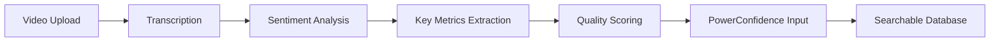
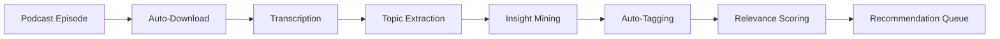
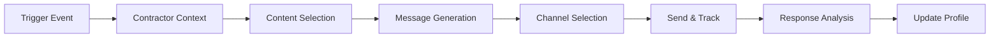

# 🤖 TPX AI-First Strategy & Architecture
*The Power100 Experience - AI Concierge Vision & Implementation Guide*

---

## 🎯 Executive Summary

The Power100 Experience (TPX) is evolving into an **AI-first platform** where artificial intelligence isn't just a feature—it's the core value proposition. Our AI Concierge will be contractors' "EVERYTHING"—a personalized business advisor available 24/7 that knows their business intimately and provides contextual, actionable guidance across all aspects of their growth journey.

### Core Vision
> "Every contractor has a personal AI advisor that knows their business better than they do, anticipates their needs, and connects them with the exact resources, knowledge, and partners they need at the precise moment they need them."

---

## 🧠 AI Concierge Capabilities

### 1. **Personalized Business Advisor**
The AI Concierge serves as an always-available expert that:
- Maintains complete context of contractor's business (revenue, team size, location, history)
- Understands current challenges and growth trajectory
- Provides proactive recommendations before problems arise
- Learns from every interaction to improve future guidance

### 2. **Intelligent Recommendation Engine**
Beyond basic matching, the AI provides:
- **Multi-dimensional recommendations** across all entities (partners, books, podcasts, events)
- **Contextual timing** - Right resource at the right moment
- **ROI predictions** - Expected outcomes based on similar contractors
- **Implementation guidance** - Not just what, but HOW

### 3. **Proactive Communication Agent**
AI-driven outreach that:
- Crafts personalized emails/texts based on contractor profile
- Triggers at optimal engagement moments
- A/B tests messaging for maximum impact
- Maintains appropriate cadence without overwhelming

### 4. **Content Analysis & Processing**
Automated analysis of all content:
- **Video Analysis**: Client demos, testimonials (sentiment, authenticity, quality)
- **Audio Processing**: Podcast transcription, summarization, insight extraction
- **Document Analysis**: Book summaries, key concepts, actionable takeaways
- **Real-time Tagging**: Auto-categorization for perfect matching

### 5. **Event Experience Orchestrator** *(NEW from Greg's Vision)*
AI-powered event companion that:
- **Pre-Event Preparation**:
  - Texts attendees to complete profile after registration
  - Creates custom event experience based on focus areas
  - Recommends "Top 3 speakers to pay attention to"
  - Suggests sponsors to meet with prepared questions
- **During-Event Guidance**:
  - Real-time speaker alerts ("Brian is about to speak...")
  - Contextual speaker relevance explanations
  - Interactive note-taking via SMS (text "notes" to capture)
  - Session attendance tracking and engagement
  - Break-time sponsor visit prompts
- **Post-Event Processing**:
  - Speaker rating system (1-10 conversational)
  - Polished event summary emailed to attendee
  - Speaker Performance Reports with actual data
  - Power Confidence Report (PCR) generation

---

## 📊 Current State vs. Target State

### ✅ What We Have

| Component | Current State | Readiness |
|-----------|--------------|-----------|
| **Contractor Profiles** | Basic (revenue, team size, focus areas) | 40% |
| **Partner Matching** | Rule-based (60/20/10/10 weights) | 60% |
| **Database Structure** | Entities exist but minimal | 30% |
| **SMS Opt-in** | Legal consent captured | 100% |
| **API Infrastructure** | RESTful, authenticated | 70% |

### 🎯 What We Need

| Component | Target State | Priority |
|-----------|-------------|----------|
| **Behavioral Data** | Complete interaction history, preferences, patterns | HIGH |
| **Content Processing** | Auto-transcription, analysis, tagging | HIGH |
| **Recommendation ML** | Predictive, learning algorithm | MEDIUM |
| **Communication Engine** | Multi-channel, personalized, automated | HIGH |
| **Feedback Loops** | Success tracking, continuous improvement | MEDIUM |

---

## 🗄️ Data Architecture for AI

### Universal AI Fields (ALL Entities)

```typescript
interface AIEnhancedEntity {
  // Core Identity
  id: string;
  type: 'partner' | 'book' | 'podcast' | 'event';
  
  // AI Analysis Fields
  ai_summary: string;                    // AI-generated summary
  ai_tags: string[];                      // Auto-extracted topics
  ai_insights: ActionableInsight[];      // Extracted actionable items
  ai_quality_score: number;              // 0-100 quality rating
  ai_relevance_scores: {                 // Per focus area
    [focusArea: string]: number;
  };
  
  // Engagement Tracking
  total_recommendations: number;          // Times recommended by AI
  positive_outcomes: number;              // Successful engagements
  contractor_feedback: FeedbackItem[];    // Direct feedback
  engagement_rate: number;               // Click/interaction rate
  
  // Cross-References
  related_entities: {
    books: string[];
    podcasts: string[];
    events: string[];
    partners: string[];
  };
  
  // ROI/Success Metrics
  success_stories: SuccessStory[];
  implementation_difficulty: 'easy' | 'moderate' | 'complex';
  time_to_value: string;                 // "immediate", "1 week", "1 month"
  investment_required: InvestmentRange;
  
  // AI Processing Metadata
  last_ai_analysis: timestamp;
  ai_confidence_score: number;           // How confident AI is in its analysis
  requires_human_review: boolean;
  processing_status: 'pending' | 'processed' | 'failed';
}
```

### Contractor Enhanced Profile

```typescript
interface AIContractorProfile {
  // Existing Fields
  id: string;
  company_name: string;
  revenue_range: string;
  team_size: number;
  focus_areas: string[];
  
  // AI Behavioral Data (NEW)
  communication_preferences: {
    channels: ('email' | 'sms' | 'phone' | 'in_app')[];
    frequency: 'daily' | 'weekly' | 'bi_weekly' | 'monthly';
    best_times: string[];               // "morning", "afternoon", "evening"
    time_zone: string;
  };
  
  learning_preferences: {
    content_type: ('video' | 'audio' | 'text' | 'interactive')[];
    session_length: 'micro' | 'short' | 'medium' | 'long';  // 5min, 15min, 30min, 60min+
    depth: 'summary' | 'detailed' | 'comprehensive';
  };
  
  // Business Context (NEW)
  business_goals: {
    goal: string;
    timeline: date;
    priority: 1-5;
    current_progress: number;           // 0-100%
  }[];
  
  current_challenges: {
    challenge: string;
    severity: 'critical' | 'high' | 'medium' | 'low';
    attempted_solutions: string[];
    open_to_solutions: boolean;
  }[];
  
  // AI Interaction History (NEW)
  ai_interactions: {
    timestamp: date;
    query: string;
    response: string;
    helpful: boolean;
    action_taken: string;
    outcome: string;
  }[];
  
  // Recommendation History (NEW)
  recommendations_received: {
    entity_type: string;
    entity_id: string;
    timestamp: date;
    reason: string;
    engagement: 'ignored' | 'viewed' | 'clicked' | 'completed';
    feedback: string;
    outcome: string;
  }[];
  
  // Predictive Metrics (NEW)
  engagement_score: number;            // 0-100, likelihood to engage
  churn_risk: number;                  // 0-100, risk of disengagement
  growth_potential: number;             // 0-100, likelihood of business growth
  next_best_action: string;            // AI-determined next step
  lifecycle_stage: 'onboarding' | 'active' | 'power_user' | 'at_risk' | 'churned';
}
```

---

## 🔄 AI Processing Pipelines

### 1. Video Analysis Pipeline (Client Demos)


**Implementation:**
- OpenAI Vision API for visual analysis
- Whisper API for audio transcription
- GPT-4 for insight extraction
- Custom scoring algorithm

### 2. Podcast Processing Pipeline


**Implementation:**
- RSS feed monitoring
- Whisper API transcription
- GPT-4 topic modeling
- Vector embeddings for semantic search

### 3. Intelligent Communication Pipeline


**Implementation:**
- Event-driven architecture
- GPT-4 for message generation
- N8N workflow orchestration
- Real-time analytics

---

## 📈 Success Metrics & KPIs

### AI Effectiveness Metrics
- **Recommendation Acceptance Rate**: % of AI suggestions acted upon
- **Time to Value**: Average time from recommendation to positive outcome
- **Engagement Lift**: Increase in platform usage after AI implementation
- **Satisfaction Score**: Contractor rating of AI assistance

### Business Impact Metrics
- **Contractor Retention**: Month-over-month active users
- **Match Quality**: Success rate of AI-matched partnerships
- **Revenue Attribution**: Revenue generated from AI recommendations
- **Support Deflection**: Reduction in human support needs

### Technical Performance Metrics
- **Processing Speed**: Time to analyze and tag content
- **Accuracy Rate**: Correct categorization/tagging percentage
- **Response Time**: AI concierge response latency
- **System Uptime**: AI service availability

---

## 🚀 Implementation Roadmap

### Phase 1: Data Foundation (Weeks 1-4)
- [ ] Extend database schemas with AI fields
- [ ] Create interaction tracking tables
- [ ] Build feedback collection mechanisms
- [ ] Implement data quality validation

### Phase 2: Content Processing (Weeks 5-8)
- [ ] Set up video analysis pipeline
- [ ] Implement podcast transcription
- [ ] Build document extraction system
- [ ] Create auto-tagging service

### Phase 3: Basic AI Concierge (Weeks 9-12)
- [ ] Develop recommendation algorithm v1
- [ ] Build chat interface
- [ ] Implement basic personalization
- [ ] Create feedback loops

### Phase 4: Intelligent Communications (Weeks 13-16)
- [ ] Design triggered campaign system
- [ ] Build message personalization engine
- [ ] Implement multi-channel delivery
- [ ] Create A/B testing framework

### Phase 5: Advanced Intelligence (Weeks 17-20)
- [ ] Deploy machine learning models
- [ ] Implement predictive analytics
- [ ] Build success prediction
- [ ] Create self-improvement loops

---

## 🔧 Technical Requirements

### AI/ML Services
- **OpenAI API**: GPT-4, Whisper, Vision
- **Vector Database**: Pinecone or Weaviate for semantic search
- **ML Framework**: TensorFlow/PyTorch for custom models
- **Processing Queue**: Redis/RabbitMQ for async processing

### Infrastructure
- **Compute**: GPU instances for model inference
- **Storage**: S3 for media files, PostgreSQL for structured data
- **CDN**: CloudFront for content delivery
- **Monitoring**: DataDog or New Relic for AI pipeline monitoring

### Integration Points
- **N8N**: Workflow orchestration
- **Twilio**: SMS delivery
- **SendGrid**: Email delivery
- **Segment**: Event tracking
- **Amplitude**: Analytics

---

## ⚠️ Critical Considerations

### Privacy & Security
- All AI processing must maintain data privacy
- Contractor data never used for training public models
- Explicit consent for AI analysis required
- Right to deletion must include AI-generated data

### Ethical AI
- Transparent about AI involvement
- Human escalation always available
- No discriminatory recommendations
- Regular bias auditing

### Scalability
- Design for 10,000+ concurrent contractors
- Async processing for all heavy operations
- Caching strategy for common queries
- Cost optimization for API calls

---

## 📋 Data Collection Strategy for Onboarding

### Every Onboarding Form Must Capture:

#### Essential AI Fields
1. **Structured Data** (dropdowns, checkboxes) over free text
2. **Granular Preferences** (not just what, but when/how/why)
3. **Historical Context** (what they've tried, what worked/didn't)
4. **Success Metrics** (how they measure success)
5. **Constraints** (budget, time, resources)

#### For Books
- Implementation guides available?
- Typical reading completion rate
- Actionable vs theoretical ratio
- Prerequisite knowledge required
- Companion resources included

#### For Podcasts
- Episode consistency/format
- Average episode length
- Guest credentials/quality
- Actionable insights per episode
- Community engagement level

#### For Events
- Historical attendance data
- Post-event support provided
- Networking quality score
- Implementation support offered
- ROI tracking mechanisms

#### For Partners
- Client success metrics (specific, measurable)
- Communication style and frequency
- Reporting capabilities
- Integration readiness
- Video testimonials for analysis

---

## 🎯 North Star Vision

By 2026, every contractor using TPX will have an AI concierge that:
1. **Knows them better than any human advisor** could
2. **Anticipates needs** before they're expressed
3. **Connects dots** across all their business data
4. **Provides ROI-proven recommendations** 
5. **Learns and improves** with every interaction

This isn't just about matching contractors with resources—it's about becoming an indispensable AI-powered growth partner that drives measurable business success.

---

## 📚 Appendix: Example AI Interactions

### Example 1: Proactive Morning Brief
```
"Good morning John! 👋 

Based on yesterday's challenge with your sales team, I found 3 resources:

1. 🎧 Podcast: 'Wealthy Contractor Ep 247' (15 mins)
   - Skip to 14:30 for sales comp structure
   - Guest grew from $5M to $12M with similar team

2. 📚 Book Chapter: 'Beyond the Hammer' Ch. 4
   - Page 127-134 specifically addresses your situation
   - Implementation worksheet included

3. 🤝 Partner Match: Destination Motivation
   - 94% success rate with sales team building
   - Available for intro call Thursday 2pm

Reply with 1, 2, or 3 to learn more, or 'later' to revisit tonight."
```

### Example 2: Intelligent Event Recommendation
```
"Hey Sarah! Noticed you're focusing on operational efficiency. 

Operation Lead Surge (Oct 15-17) has 3 sessions perfect for you:
- 'Systemizing for Scale' - Day 1, 10am
- 'Tech Stack Optimization' - Day 2, 2pm  
- 'Building SOPs That Stick' - Day 3, 9am

Plus: 2 contractors from Orlando (your area) are attending.
Early bird saves $200 (expires Friday).

Want me to:
A) Reserve your spot
B) Send full agenda
C) Connect you with other attendees
D) Remind me later"
```

### Example 3: Success Prediction & Guidance
```
"Analysis of your business data shows:

📈 Growth Opportunity Detected
Your metrics match contractors who scaled 40-60% after focusing on 'hiring sales leadership.'

Recommended 90-day plan:
Week 1-2: Listen to these 3 podcasts (links below)
Week 3-4: Implement hiring framework from 'Beyond the Hammer'
Week 5-8: Work with Destination Motivation on team structure
Week 9-12: Track metrics, adjust compensation model

Expected outcome: 2-3 quality hires, 25% sales increase

Start with step 1? (Y/N)"
```

---

*Last Updated: December 2024*
*Version: 1.0*
*Status: Living Document - Update as AI capabilities evolve*