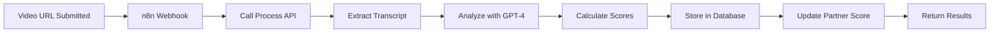

# 🎥 Video AI Analysis Automation Documentation

## Overview
This document describes the automated video analysis pipeline that uses AI to analyze partner demo videos, customer testimonials, and other video content for quality scoring, insight extraction, and content relevance validation.

## 🚀 Quick Start

### 1. Import n8n Workflow
1. Open n8n interface: http://localhost:5678
2. Go to Workflows → Import from File
3. Select: `n8n-workflows/video-ai-analysis-trigger-dev.json`
4. Activate the workflow (toggle switch to ON)

### 2. Test the System
```bash
# Test direct API (bypass n8n)
node test-video-analysis-direct.js

# Test via n8n webhook (after importing workflow)
node test-video-analysis-webhook.js

# Test with custom video URL
node test-video-analysis-webhook.js "https://www.youtube.com/watch?v=YOUR_VIDEO_ID" 1
```

## 📊 System Architecture

### Components
1. **Video Analysis Service** (`videoAnalysisService.js`)
   - YouTube transcript extraction
   - OpenAI GPT-4 Vision API for frame analysis
   - Quality scoring algorithm
   - Insight extraction

2. **API Endpoint** (`/api/video-analysis/process`)
   - Receives video URL and optional partner_id
   - Triggers analysis pipeline
   - Stores results in database

3. **n8n Webhook** (`trigger-video-analysis-dev`)
   - Webhook URL: `http://localhost:5678/webhook/trigger-video-analysis-dev`
   - Triggers API endpoint
   - Returns analysis results

4. **Database Tables**
   - `video_content` - Stores video metadata and AI results
   - `video_analysis` - Detailed analysis metrics
   - `partners` - Updated with demo_quality_score

## 🔄 Workflow Process



## 📝 API Reference

### Trigger Video Analysis

**Endpoint:** `POST /api/video-analysis/process`

**Headers:**
```json
{
  "Content-Type": "application/json",
  "Authorization": "Bearer YOUR_JWT_TOKEN"
}
```

**Request Body:**
```json
{
  "video_url": "https://www.youtube.com/watch?v=VIDEO_ID",
  "partner_id": 1,  // Optional
  "analysis_type": "demo_analysis"  // Optional, defaults to "demo_analysis"
}
```

**Response:**
```json
{
  "success": true,
  "message": "Video analyzed successfully",
  "data": {
    "analysis_id": 5,
    "video_url": "https://...",
    "quality_score": 85,
    "insights": {
      "quality_score": 85,
      "content_relevant": true,
      "strengths": ["Clear value proposition", "Good demo flow"],
      "improvements": ["Add more use cases", "Include pricing"],
      "focus_areas": ["sales_marketing", "operations"],
      "key_features": ["Dashboard", "Reporting", "Automation"]
    }
  }
}
```

## 📊 Quality Scoring Criteria

The AI evaluates videos on 5 key criteria (20 points each):

1. **Presentation Clarity** (0-20)
   - Clear speech and explanations
   - Logical flow of information
   - Easy to follow demonstrations

2. **Value Proposition** (0-20)
   - Clear articulation of benefits
   - ROI and outcomes highlighted
   - Differentiation from competitors

3. **Technical Demonstration** (0-20)
   - Features shown effectively
   - UI/UX clearly visible
   - Integration capabilities demonstrated

4. **Customer Benefits** (0-20)
   - Pain points addressed
   - Use cases explained
   - Success metrics shared

5. **Production Quality** (0-20)
   - Video/audio quality
   - Professional appearance
   - Engaging presentation style

## 🚨 Content Relevance Detection

The system automatically detects non-business content and provides appropriate feedback:

```json
{
  "content_relevant": false,
  "relevance_issue": "This is a music video, not a business demo",
  "quality_score": 0,
  "recommendations": [
    "Upload an actual product demo video",
    "Use testimonial or case study content",
    "Ensure video showcases business solutions"
  ]
}
```

## 🗄️ Database Schema

### video_content Table
```sql
- id: INTEGER PRIMARY KEY
- entity_type: VARCHAR (e.g., 'partner')
- entity_id: INTEGER
- video_type: VARCHAR (e.g., 'demo', 'testimonial')
- file_url: TEXT (YouTube or other video URL)
- ai_processing_status: VARCHAR
- ai_summary: TEXT
- ai_insights: JSONB
- ai_engagement_score: NUMERIC
- last_ai_analysis: TIMESTAMP
```

### video_analysis Table
```sql
- id: INTEGER PRIMARY KEY
- video_id: INTEGER REFERENCES video_content
- analysis_type: VARCHAR
- visual_quality_score: NUMERIC
- demo_structure_score: NUMERIC
- value_prop_clarity: NUMERIC
- key_talking_points: JSONB
- unique_value_props: JSONB
- use_cases_mentioned: JSONB
- frames_analyzed: INTEGER
- ai_models_used: JSONB
```

## 🔧 Configuration

### Environment Variables
```bash
# Backend (.env)
OPENAI_API_KEY=your_openai_api_key
JWT_SECRET=your_jwt_secret

# n8n workflow
Authorization Token: Bearer eyJhbG...
```

### Supported Video Formats
- YouTube URLs (recommended)
- Direct video file URLs (limited frame extraction)
- Vimeo URLs (transcript not available)

## 📈 Metrics & Monitoring

### Key Metrics Tracked
- Average quality scores by partner
- Content relevance rate
- Processing time per video
- AI token usage and costs
- Success/failure rates

### Check Recent Analyses
```sql
-- View recent video analyses
SELECT
    vc.file_url,
    vc.entity_type,
    vc.ai_engagement_score as quality_score,
    vc.ai_processing_status,
    vc.last_ai_analysis
FROM video_content vc
ORDER BY vc.last_ai_analysis DESC
LIMIT 10;

-- Partner demo scores
SELECT
    p.company_name,
    p.demo_quality_score,
    p.demo_video_url
FROM partners p
WHERE p.demo_quality_score IS NOT NULL
ORDER BY p.demo_quality_score DESC;
```

## 🧪 Testing

### Test Scenarios

1. **Valid Business Demo Video**
```javascript
{
  "video_url": "https://www.youtube.com/watch?v=BUSINESS_DEMO_ID",
  "partner_id": 1
}
// Expected: Quality score 60-95, relevant insights
```

2. **Non-Business Content**
```javascript
{
  "video_url": "https://www.youtube.com/watch?v=MUSIC_VIDEO_ID"
}
// Expected: quality_score: 0, content_relevant: false
```

3. **Video Without Transcript**
```javascript
{
  "video_url": "https://private-video-server.com/demo.mp4"
}
// Expected: Analysis based on thumbnail only
```

## 🛠️ Troubleshooting

### Common Issues

1. **"No transcript available"**
   - YouTube video may have disabled captions
   - Video is private or age-restricted
   - Solution: Ensure video is public with captions enabled

2. **Low quality scores**
   - Check the scoring breakdown in insights
   - Review improvement recommendations
   - Compare against high-scoring demos

3. **Webhook not responding**
   - Verify n8n workflow is active
   - Check webhook URL matches exactly
   - Ensure backend is running on port 5000

4. **Authentication errors**
   - Token may be expired
   - Generate new token: `node generate-jwt-token.js`
   - Update token in n8n workflow

## 🚀 Production Deployment

### Create Production Workflow
1. Duplicate the dev workflow in n8n
2. Rename to "Video AI Analysis Trigger - Prod"
3. Change webhook path to `trigger-video-analysis-prod`
4. Update API URL to production backend
5. Update authorization token for production

### Production Testing
```bash
# Update test script URLs for production
const N8N_WEBHOOK_URL = 'https://n8n.power100.io/webhook/trigger-video-analysis-prod';
const API_URL = 'https://api.power100.io/api/video-analysis/process';
```

## 📊 Success Metrics

### What Good Looks Like
- **Quality Score**: 80+ for professional demos
- **Processing Time**: < 30 seconds per video
- **Relevance Rate**: 95%+ business content detected correctly
- **Insight Quality**: 3+ actionable improvements per video

### ROI Tracking
- Partner conversion improvement after demo optimization
- Time saved on manual video review
- Consistency in partner quality assessment
- Data-driven demo improvement recommendations

## 🔗 Related Documentation
- [AI-First Strategy](./AI-FIRST-STRATEGY.md)
- [Database to AI Automation](./DATABASE-TO-AI-AUTOMATION.md)
- [n8n Workflow Format Requirements](./N8N-WORKFLOW-FORMAT-REQUIREMENTS.md)
- [Partner AI Processing](../n8n-workflows/partner-ai-processing-complete.json)

## 📅 Implementation Status
- ✅ Video Analysis Service - COMPLETE
- ✅ API Endpoints - COMPLETE
- ✅ Database Schema - COMPLETE
- ✅ n8n Workflow (Dev) - COMPLETE
- ✅ Testing Scripts - COMPLETE
- ⏳ Production Deployment - PENDING
- ⏳ Transcription Service - PENDING (Whisper API)

Last Updated: September 21, 2025
Version: 1.0